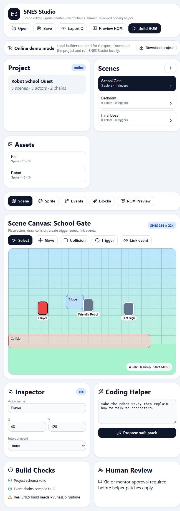

# SNES Studio 1.0.9


SNES Studio is a kid-friendly, human-in-the-loop, agent-assisted game builder for Super Nintendo homebrew projects.


[Join SNES-Studio Discord here](https://discord.gg/RCbYU3aP)

## Screenshots

### Main Editor UI


### Sample Game: Pocket Bugs


### Sample Game: Character Sheet


### Sample Game: OpenArt Contact


### Sprite Sheets


This 1.1.1 repository is a complete publishable MVP. It gives you a polished editor shell, a real project model, top-down and platformer scene workflows, sprite editing primitives, event-chain logic, optional reviewed AI helper tools, C export, GitHub Pages demo mode, Discord Activity mode, and local backend mode.

The studio opens on its flagship showcase game, **Pocket Bugs** - a garden-bug battler where kids catch bugs in matchboxes and battle in backyard tournaments. It's built entirely from SNES Studio's own scene/sprite/event model (`python scripts/make_pocket_bugs.py`) and ships with embedded CC0 OpenGameArt sprite/tile sources documented in `docs/ASSET_SOURCES.md`.

Real playable SNES ROM generation is supported when PVSnesLib is installed. The `--skip-build` path still exists for CI/release workflow testing and produces a placeholder `.sfc`.

## Why this exists

Most beginner game tools either hide all code or expose too much code too early. SNES Studio uses a different workflow:

```text
Kid idea
  -> helper proposes a patch
  -> kid or mentor reviews it
  -> patch is applied safely
  -> project validates
  -> event chains compile to readable C stubs
  -> ROM build workflow is prepared
```

The agent never silently edits the game. Every helper change is reviewable.

## Main features

- Polished React editor UI
- GitHub Pages online demo mode
- Discord Activity mode for publishing inside Discord
- Local Python/FastAPI backend mode
- Scene list and scene canvas
- Top-down adventure scenes and platformer / side-scroller scenes
- Tile-based background editor (Zelda/Pokemon-style) with a bundled OpenGameArt overworld tileset, painted to real SNES BG tilemaps
- Actor editing: add, update, delete, move
- Collision and trigger zones
- Pixel sprite editor data model
- Event chain editor data model
- Block palette definitions
- Optional human-reviewed agent patches, hidden behind Studio Settings by default
- Safe backup-before-write server behavior
- Project import/export as `.snesproj`
- Generated C export using Jinja templates
- CLI workflow for classrooms and CI
- GitHub Actions for backend tests, frontend build, Pages deploy, and release artifacts

## Bundled art

The showcase and template projects use converted CC0 OpenGameArt assets instead of generated placeholder sprites. To regenerate the embedded art from source packs:

```bash
pip install -e ".[art]"
python scripts/import_open_art_assets.py
```

See `docs/ASSET_SOURCES.md` for source links and licensing notes.

## Quick start: backend

```bash
python -m venv .venv
source .venv/bin/activate
pip install -e ".[dev,server]"

snes-studio validate examples/hello-human/project.snesproj
snes-studio inventory examples/hello-human/project.snesproj
snes-studio serve examples/hello-human/project.snesproj --host 127.0.0.1 --port 8765
```

## Quick start: frontend

```bash
cd web
npm install
npm run dev
```

Open the Vite URL. If the backend is running, the UI uses local builder mode. If not, it falls back to online demo mode and loads the bundled sample project.

## CLI examples

```bash
snes-studio validate examples/hello-human/project.snesproj --json
snes-studio inventory examples/hello-human/project.snesproj --json
snes-studio play examples/pocket-bugs/project.snesproj   # play the game end to end in the terminal
snes-studio export-c examples/hello-human/project.snesproj build/generated/hello-human --json
snes-studio make:rom examples/hello-human/project.snesproj build/hello-human.sfc --skip-build --json
scripts/validate-rom.sh build/hello-human.sfc
```

## Automated testing

Backend and compiler integration tests:

```bash
python -m pytest -q
```

This suite includes ROM-input integration checks (project edits -> generated
`main.c`/tilemaps via `make:rom --skip-build`).

Browser E2E workflow tests (Playwright):

```bash
cd web
npm install
npx playwright install --with-deps chromium
npm run test:e2e
```

Playwright starts both local services automatically:

- `snes-studio serve examples/hello-human/project.snesproj --port 8765`
- `vite dev --host 127.0.0.1 --port 5173`

## Editor API examples

```bash
snes-studio add-scene examples/hello-human/project.snesproj --id lab --name "Robot Lab"
snes-studio add-actor examples/hello-human/project.snesproj --scene lab --id mentor --name "Mentor Bot" --x 80 --y 120 --sprite robot
snes-studio add-event-chain examples/hello-human/project.snesproj --id mentor_intro --name "Mentor Intro"
snes-studio add-step examples/hello-human/project.snesproj --chain mentor_intro --type show_text --text "Welcome to SNES Studio."
```

## Building a real ROM: PVSnesLib toolchain setup

The asset/tilemap pipeline and the generated C are produced and tested **without**
any SNES toolchain. Only the final ROM assembly needs **PVSnesLib**. Once it is
installed, `make:rom` (without `--skip-build`) compiles a real `.sfc`.

The generated build directory contains everything needed: `main.c`, the
PVSnesLib engine `snesstudio_snes.c`, pre-converted `snesstudio_assets.c`
(4bpp tiles + BGR555 palettes), `snesstudio_maps.c` (background tilemaps), and a
`Makefile`.

### 1. Install PVSnesLib

```bash
# Linux/macOS (see https://github.com/alekmaul/pvsneslib for the latest)
git clone https://github.com/alekmaul/pvsneslib.git
cd pvsneslib
# Follow the repo's install instructions for your OS, then:
export PVSNESLIB_HOME=/absolute/path/to/pvsneslib
```

On Windows, use the PVSnesLib release installer or WSL, then set
`PVSNESLIB_HOME` to the install path.

### 2. Convert + build

```bash
snes-studio export-assets   examples/hello-human/project.snesproj build/generated/hello-human
snes-studio export-tilemaps examples/hello-human/project.snesproj build/generated/hello-human
snes-studio export-c        examples/hello-human/project.snesproj build/generated/hello-human
snes-studio make:rom        examples/hello-human/project.snesproj build/hello-human.sfc   # no --skip-build
```

`make:rom` shells out to `make` in the generated directory. If `PVSNESLIB_HOME`
is unset or the toolchain is missing, it fails with a clear message; use
`--skip-build` to produce a placeholder `.sfc` for workflow/CI testing instead.

### 3. Run it

Load `build/hello-human.sfc` in any SNES emulator (bsnes, Mesen-S, Snes9x). The
generated engine is a top-down overworld: the D-pad walks the player sprite with
tilemap collision, and `show_text` event steps render a dialogue box (advance
with **A**).

> PVSnesLib helper signatures vary slightly between versions. If a PPU/OAM call
> in `snesstudio_snes.c` does not match your installed headers, each call is
> commented with its intent so it is quick to adjust. See `docs/ENGINE.md`.

## ROM Preview (EmulatorJS)

The **ROM Preview** tab plays a homebrew SNES ROM in the browser using
[EmulatorJS](https://emulatorjs.org/). Click **Load .sfc / .smc**, pick a ROM you
built with `snes-studio make:rom` (or any homebrew ROM you own), and play it. No
copyrighted ROMs are bundled and files never leave your browser. See
`docs/EMULATOR.md`.

## Hosting the UI for free


The web UI is a static Vite app (online demo mode — no backend needed). Deploy it on any static host:

- **Vercel** — import the repo; `vercel.json` builds `web/` and serves `web/dist`.
- **Netlify** — import the repo; `netlify.toml` sets base `web/`, publish `dist`.
- **GitHub Pages** — push to GitHub and enable Pages; `.github/workflows/pages.yml` builds and deploys `web/` automatically.

All three host only the editor + EmulatorJS front-end. They cannot run the Python backend or build ROMs — that needs local mode or a future hosted build service.

A hosted static deploy can:

- load a bundled sample project
- edit scenes, actors, sprites, and event chains in the browser
- propose deterministic safe patches
- apply patches after human review
- download `.snesproj`
- play a homebrew `.sfc`/`.smc` you load in the ROM Preview tab

## Discord Activity

SNES Studio can run as a Discord Activity using the Embedded App SDK. The web app detects Discord launches, performs the SDK ready handshake, and keeps normal browser/desktop behavior unchanged.

Application details for the current Discord app:

- Application ID / Client ID: `1514005235205668924`
- Public Key: `f47a2a4b0e4981a76f7bb7288cb9de372693dafef108d9ebf0da9b12ef3ec493`
- App icon: `web/public/branding/discord-icon-1024.png`
- Suggested description: `Create and share SNES-style games in Discord. Build maps, sprites, events, top-down adventures, and platformer scenes, then export your project.`
- Suggested tags: `snes`, `super-nintendo`, `game-dev`, `pixel-art`, `education`

Deploy `web/dist` to Vercel, Netlify, or another public HTTPS host. In Discord Developer Portal, enable Activities and add this URL mapping:

| Prefix | Target |
| --- | --- |
| `/` | `<your-public-host>` |

Do not include `https://` in the mapping target. GitHub Pages also works if Pages is enabled for the repository and plan; this repo’s relative Vite asset base supports Discord proxy mappings. Full setup instructions are in `docs/DISCORD_ACTIVITY.md`.

## Desktop installers (Windows + macOS)

Installers are built on tag pushes (`v*`) by:

- `.github/workflows/release-installers.yml`
- `scripts/package_windows.ps1` -> `dist/SNES-Studio-Setup.exe`
- `scripts/package_macos.sh` -> `dist/SNES-Studio-macOS.pkg`

To build and verify the Windows installer locally:

```powershell
# One-time prerequisite for full installer output:
# install Inno Setup 6 so ISCC.exe exists (PATH or default install dir)
./scripts/package_windows.ps1 -Version 1.1.1-local
```

If you only need to verify the desktop/CLI payload binaries locally (without generating the `.exe` installer):

```powershell
./scripts/package_windows.ps1 -Version 1.1.1-local -SkipInstaller
./build/windows/payload/snes-studio.exe validate examples/hello-human/project.snesproj --json
```

The installers include:

- **SNES Studio** — one-click desktop launcher that starts the local backend, serves the bundled web UI, opens the browser, and stores the editable Pocket Bugs starter project in the user's app-data folder.
- **snes-studio** — CLI for validation, export, simulation, server mode, and ROM builds.

The web UI includes an **Installers** card with download links. By default those
links point to the latest GitHub release for `eoinjordan/snes-studio`. To point
them to a fork or another release repo, set:

```bash
VITE_GITHUB_REPO=owner/repo
```


## Versioning, Tags, and Build Information

**Current version:** 1.1.1

This project uses [semantic versioning](https://semver.org/) for releases. Each release is tagged in git as `vX.Y.Z` (e.g., `v1.0.7`).

### Release and Build Tags

- **Release tags**: Every push of a tag matching `v*` (e.g., `v1.0.7`) triggers the GitHub Actions workflows to build and publish release artifacts and installers.
- **Build tags**: The installer and artifact workflows in `.github/workflows/release-installers.yml` and `.github/workflows/release-snes.yml` are triggered by these tags.
- **Version bump**: Update the version in `pyproject.toml` and the README before tagging a new release.

#### Example release process

1. Update `pyproject.toml` and README to the new version (e.g., 1.0.7).
2. Commit and push changes.
3. Tag the release: `git tag v1.0.7 && git push --tags`
4. GitHub Actions will build and upload the installers and artifacts for this tag.

#### Installer build details

Installers are built on tag pushes (`v*`) by:
- `.github/workflows/release-installers.yml`
- `scripts/package_windows.ps1` → `dist/SNES-Studio-Setup.exe`
- `scripts/package_macos.sh` → `dist/SNES-Studio-macOS.pkg`

See the workflow files for more details.

## What 1.1.1 means

Version 1.1.1 means the repository is clean, publishable, documented, testable, supports Discord Activity launch, includes first-class platformer scene metadata/runtime behavior, and fixes a Windows desktop launcher Uvicorn logging formatter issue seen in the installer build. It does not mean feature parity with GB Studio or a production-ready SNES compiler.

## Roadmap

See:

- `docs/ROADMAP.md`
- `docs/FEATURES.md`
- `docs/ISSUES.md`
- `docs/TOOLCHAIN.md`
- `docs/EMULATOR.md`
- `docs/DISCORD_ACTIVITY.md`
- `docs/HUMAN_IN_THE_LOOP.md`
